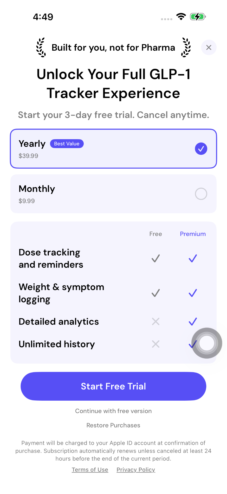
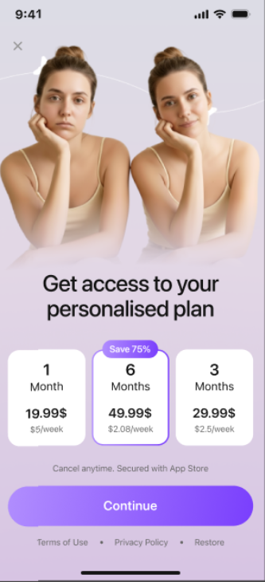
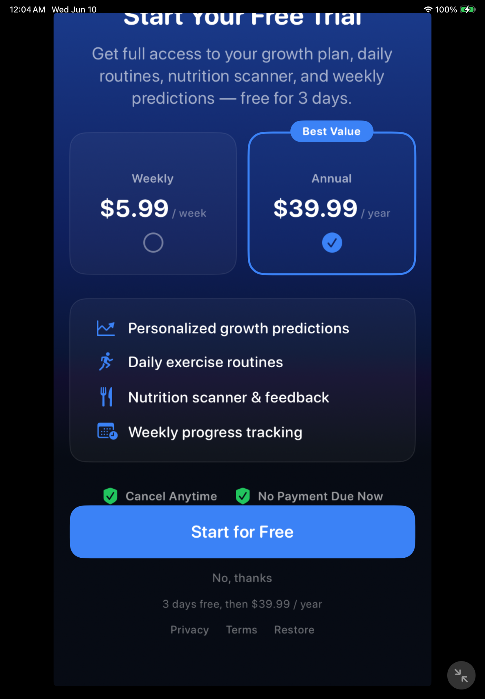
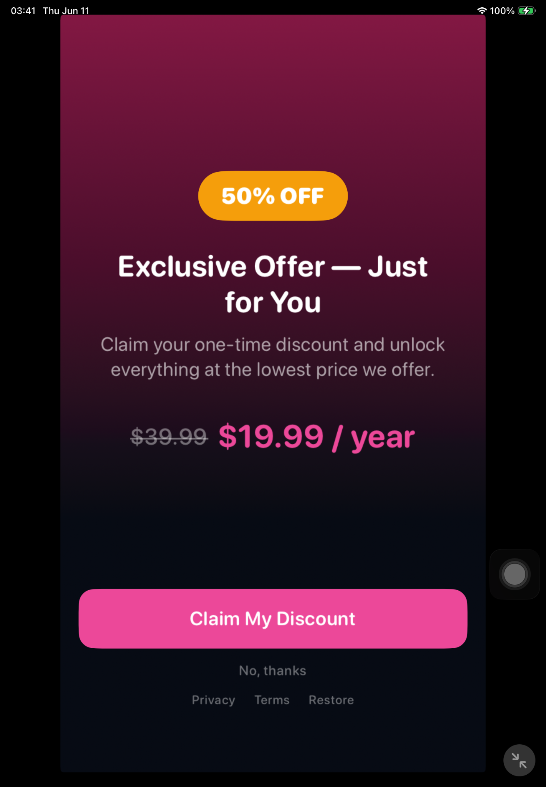

# Как быстро пройти модерацию в App Store

Гайд для фаундеров: что подготовить до отправки, из-за чего чаще всего реджектят и что делать, если реджект уже получен.

Собрано из практики Студии Along (десятки опубликованных подписочных приложений за 5 лет) и реальных запросов App Review.

---

## Главный принцип

Быстрая модерация — это не про скорость Apple. Это про **количество кругов**. Один круг ревью — это 1–7 дней. Приложение, которое прошло с первого раза, публикуется за неделю; приложение, которое собрало три реджекта, — за месяц.

Всё в этом документе служит одной цели: **не дать поводов для второго круга.**

Три вещи дают наибольший эффект:

1. **Заполнить поле Notes по всем пунктам, которые Apple обычно запрашивает отдельным письмом** ([раздел 3](#3-notes--самое-недооценённое-поле-в-app-store-connect)). Это снимает целый класс реджектов до того, как они случатся.
2. **Проверить пейвол** ([раздел 5.1](#51-пейволы-и-подписки--самая-частая-причина-реджекта)) — самая частая причина отказа у подписочных приложений. Там шесть реальных отказов с формулировками Apple и скриншотами.
3. **Не наматывать круги при непонятном реджекте — заказать звонок** ([раздел 6](#6-если-вы-получили-reject)).

---

## 1. Что должно быть готово до отправки

Три блока, из-за которых чаще всего получают реджект на самом старте.

### 1.1. Privacy Policy и Terms of Use

У вас **должен быть сайт** с двумя документами: Privacy Policy и Terms of Use. Без них публикация невозможна.

Ссылки вставляются в **двух местах** — забывают обычно про первое:

1. В **description** приложения (в самом тексте, в конце)
2. В **отдельные поля** на странице App Store Connect

> **Практика:** документы генерируются легко (есть генераторы), а хостить их можно на **Google Sites** — Apple это пропускает. Мы так делаем, способ работает. Отдельный домен и вёрстка не нужны.

### 1.2. Permissions (разрешения)

Всё, к чему приложение запрашивает доступ, должно быть указано **и в App Store Connect, и в самом приложении** (Info.plist, usage descriptions).

Типичный набор:
- Push-уведомления — если отправляете уведомления
- Встроенные покупки — включены по умолчанию для подписочных приложений
- Apple Health — если читаете или пишете данные здоровья
- Геолокация, камера, контакты, микрофон, App Tracking Transparency — если используете

> Несовпадение между тем, что заявлено, и тем, что приложение реально запрашивает, — **очень частая причина реджекта.**

### 1.3. Скриншоты — только реальные экраны

**Экраны на скриншотах должны быть реальными экранами приложения.** Apple за этим очень сильно следит.

Рисовать приложение на скриншотах красивее, чем оно есть в реальности — верный способ получить reject. Оформление, фон, подписи, рамки устройства — можно. Придуманные интерфейсы, которых нет в билде — нельзя.

Технические требования:
- Минимум 5 скриншотов
- Обязателен набор под самый большой iPhone (6.9"). Отдельные наборы под 5.5" больше не нужны — Apple масштабирует их сама
- Нельзя использовать реальные изображения устройств Apple — используйте device frames
- Иконка: PNG 1024×1024, **без прозрачности**, **без скруглённых углов** (Apple применяет маску сама), без изображений устройств Apple и без beta/placeholder-элементов
- Preview video: максимум 30 секунд, контент должен соответствовать реальному опыту приложения

### 1.4. Description: что бесплатно, что платно

Если приложение монетизируется через подписку или IAP — description **обязан** явно указывать, что доступно бесплатно и что требует покупки. Без этого Apple отклоняет по **Guideline 2.3.2** («paid content not clearly identified»).

Достаточно одной-двух фраз в финальном абзаце: что бесплатно + что по подписке + что подписку можно отменить в любой момент. Отдельный раздел делать не нужно.

> **Это касается и скриншотов, не только description.** Если на скриншоте показана платная фича, а нигде не сказано, что она платная — это тот же 2.3.2. Реальный отказ с формулировкой Apple — [кейс D](#кейс-d-платные-фичи-не-помечены-в-метаданных-232).

Также не используйте «лучший», «номер один», «#1» без доказательств — Apple может отклонить.

### 1.5. Заодно: то, что не поменять без нового билда

Не связано с модерацией напрямую, но экономит вам целый круг ревью — потому что менять это потом придётся с новым билдом:

| Поле | Меняется без билда? |
|---|---|
| Title, Subtitle, **Keyword field** | Нет |
| Description | Нет |
| Promotional Text | **Да**, в любой момент |
| Скриншоты, Preview video | Да, но проходят отдельное App Review |

Проверьте перед отправкой, что **keyword field заполнен** — его часто забывают, а он влияет на поиск и требует нового билда для правки.

### Чеклист

- [ ] Privacy Policy и Terms of Use доступны по ссылке
- [ ] Ссылки вставлены в description
- [ ] Ссылки вставлены в отдельные поля App Store Connect
- [ ] Permissions в ASC совпадают с кодом приложения
- [ ] Скриншоты — реальные экраны приложения
- [ ] Минимум 5 скриншотов в наборе под 6.9"
- [ ] Иконка: PNG 1024×1024, без alpha, без скруглений
- [ ] В description явно сказано, что бесплатно и что платно
- [ ] Keyword field заполнен

---

## 2. Приложение должно работать без багов

Это база, но именно она чаще всего подводит. Apple **реально проходит ваше приложение** — смотрит контент внутри, проверяет, что оно работает адекватно и что это настоящий продукт, а не заглушка.

Пройдите приложение целиком сами, на **физическом устройстве**, перед отправкой.

### Тестовые данные для авторизации

Если в приложении есть авторизация — вы **обязаны** указать ревьюеру тестовые креды, по которым он войдёт и увидит контент так, как будто у него полный доступ.

Проверьте перед отправкой: аккаунт живой, пароль актуальный, у аккаунта открыт **весь платный контент**.

---

## 3. Notes — самое недооценённое поле в App Store Connect

Помимо тестовых данных и контактной информации, в разделе App Review Information есть поле **Notes**. Там можно подробно расписать для ревьюеров, на что именно стоит обратить внимание.

**Это работает в обе стороны.**

**Ускорение проверки.** Если вы выпускаете простое обновление — например, только поменяли скриншоты — так и напишите: «В приложении не сделано никаких серьёзных изменений, мы обновляем только скриншоты». Apple понимает, что досконально проверять всё приложение не нужно, и проверка идёт быстрее.

**Предотвращение реджектов.** Apple периодически присылает запрос по **Guideline 2.1** с требованием прислать полный набор информации о приложении — и прямо пишет: включайте эту информацию в поле Notes **для будущих отправок**. Значит, если заполнить Notes по этим пунктам **до первой отправки**, вы этот запрос, скорее всего, никогда не получите.

Полный список того, что запрашивает Apple, — в [разделе 7](#7-если-apple-запросила-информацию-guideline-21). Готовый шаблон — в [Приложении A](#приложение-a-шаблон-поля-notes).

---

## 4. Кнопку «Add for Review» можно нажимать спокойно

Перед отправкой пройдитесь по всем разделам App Store Connect и проверьте, что все поля заполнены.

Но даже если что-то забыли: при попытке отправить приложение Apple **сама всё проверит** и подсветит, какие поля нужно дозаполнить.

> Нажатие «Add for Review» **не отправляет приложение на ревью автоматически.** Оно готовит драфт и показывает ошибки валидации, если они есть. Не бойтесь нажимать эту кнопку — используйте её как бесплатную предпроверку.

Обратное тоже верно: **отсутствие ошибок при отправке не гарантирует прохождение ревью.** Валидация полей — это только формальная проверка, содержательные причины реджекта ниже.

---

## 5. Частые причины реджекта

### 5.1. Пейволы и подписки — самая частая причина реджекта

Всё, что связано с пейволами, платежами и попытками заставить пользователя купить подписку. Ниже — **реальные отказы, полученные нашими приложениями за последнее время**, с формулировками Apple, скриншотами и тем, что именно надо было исправить.

Сводка гайдлайнов, по которым отказывают:

| Guideline | О чём | Кейс |
|---|---|---|
| **3.1.2(c)** Subscriptions | Триал заметнее суммы списания | [→ A](#кейс-a-триал-кричит-громче-цены-312c) |
| **3.1.2(c)** Subscriptions | Не сказано, что пользователь получает за деньги | [→ B](#кейс-b-непонятно-что-покупаешь-312c) |
| **5.6** Developer Code of Conduct | Второй оффер сразу после закрытия пейвола | [→ C](#кейс-c-скидка-сразу-после-закрытия-пейвола-56) |
| **2.3.2** Accurate Metadata | Платные фичи в описании и скриншотах не помечены как платные | [→ D](#кейс-d-платные-фичи-не-помечены-в-метаданных-232) |
| **2.3.2** Accurate Metadata | Промо-картинка для promoted IAP = иконка приложения | [→ E](#кейс-e-промо-картинка-для-promoted-iap-232) |
| **3.1.1** In-App Purchase | Промокоды разблокируют платный контент | [→ F](#кейс-f-промокоды-разблокируют-контент-311) |

---

#### Кейс A. Триал кричит громче цены (3.1.2(c))



**Что написала Apple:**

> One or more auto-renewable subscriptions are marketed in the purchase flow in a way that may mislead or confuse users about the subscription terms or pricing. Specifically: the auto-renewable subscription promotes the free trial, introductory pricing, or introductory period for the subscription more clearly and conspicuously than the billed amount.

**Что не так на экране.** «Start your 3-day free trial. Cancel anytime.» — крупным текстом под заголовком. Кнопка — «Start Free Trial», самый заметный элемент экрана. А `$39.99` — мелкий серый текст под словом «Yearly». Пользователь видит «бесплатно», а не «сорок долларов в год».

**Требование Apple дословно:** сумма списания должна быть **самым заметным элементом цены** в раскладке. Все остальные ценовые элементы — триал, вводная цена, пересчёт «$X в неделю» — должны быть в подчинённом положении и **меньшего размера**, чем полная сумма списания.

Apple прямо перечисляет, что оценивается: **шрифт, размер, цвет и расположение** суммы списания.

**Как исправить:**
- `$39.99 / year` — крупно, основным цветом текста, выше или рядом с кнопкой
- «3-day free trial» — мельче и ниже суммы
- Кнопка: `Start — $39.99/year` или `Continue`, а не «Start Free Trial»
- Пересчёт «$0.77 / week» — самым мелким кеглем, если он вообще нужен

---

#### Кейс B. Непонятно, что покупаешь (3.1.2(c))



**Что написала Apple:**

> We continue to notice the app uses auto-renewable subscriptions, but it does not clearly describe what the user will receive for the price.

**Что не так на экране.** «Get access to your personalised plan» — и три тарифа: 1 месяц / 6 месяцев / 3 месяца. И всё. Что входит в «personalised plan», из экрана понять невозможно. Есть цены, нет описания продукта.

Обратите внимание на «**We continue to notice**» — это повторный отказ. Первый раз проигнорировали.

**Как исправить:** добавить на пейвол явный перечень того, что даёт подписка — 3–5 пунктов конкретными формулировками. Не «premium access» и не «all features», а что именно пользователь получит.

---

#### Кейс C. Скидка сразу после закрытия пейвола (5.6)

<table>
<tr><td width="50%"><br><em>1. Пользователь закрывает этот пейвол…</em></td>
<td width="50%"><br><em>2. …и сразу получает этот</em></td></tr>
</table>

**Что написала Apple:**

> The app attempts to manipulate customers into making unwanted In-App Purchases. Specifically, the app displayed an offer immediately after closing the initial paywall.

**Что не так.** Пользователь нажал «No, thanks» — и вместо того, чтобы попасть в приложение, получил «50% OFF — Exclusive Offer — Just for You» с зачёркнутой ценой. Классическая воронка с downsell-оффером.

Это не 3.1.2 и не 2.3.2, это **Developer Code of Conduct** — самый неприятный тип отказа, потому что Apple квалифицирует его как манипуляцию пользователем, а не как ошибку в оформлении.

**Что важно понять:** downsell-оффер сам по себе не запрещён. Запрещено показывать его **сразу после того, как пользователь отказался**. Отказ пользователя должен быть отказом — он попадает в приложение.

**Как исправить:** после «No, thanks» — пускать в приложение. Скидочный оффер показывать позже: через сессию, по триггеру внутри продукта, в другом месте флоу. Не подряд.

---

#### Кейс D. Платные фичи не помечены в метаданных (2.3.2)

**Что написала Apple:**

> We noticed the app's metadata refers to paid content or features, but they are not clearly identified as requiring additional purchase. Specifically, your app description and screenshot references app's key features but does not inform users that a purchase is required to access this content.
>
> Paid digital content referenced in your metadata must be clearly labelled to ensure users understand what is and isn't included in the app.

**Что не так.** Description и **скриншоты** рекламируют ключевые фичи приложения, но нигде не сказано, что для доступа к ним нужна покупка. Пользователь читает страницу и думает, что всё это входит в бесплатное приложение.

**Важно: это касается не только description, но и скриншотов.** Если на скриншоте показана платная фича — на нём должна быть пометка.

**Как исправить:**
- В description — явный абзац: что бесплатно, что по подписке (см. [раздел 1.4](#14-description-что-бесплатно-что-платно))
- На скриншотах с платными фичами — пометка вида «Premium» или «Requires subscription»
- Либо убрать упоминания платных фич из метаданных совсем

---

#### Кейс E. Промо-картинка для promoted IAP (2.3.2)

**Что написала Apple:**

> We noticed that your promotional image to be displayed on the App Store does not sufficiently represent the associated promoted In-App Purchase and/or win back offer. Specifically:
> – Your promotional image is the same as the app's icon.
> – You submitted duplicate or identical promotional images for different promoted In-App Purchase products and/or win back offers.

**Что не так.** Это про **Promoted In-App Purchases** — покупки, которые выводятся прямо на страницу приложения в App Store. Для каждой нужна своя промо-картинка. Загрузили иконку приложения вместо картинки, и одну и ту же на разные продукты.

**Как исправить:**
- Своя уникальная картинка на каждый promoted IAP, отражающая именно этот продукт
- Не иконка приложения
- Если продвигать эти покупки не планируете — **удалить промо-картинки в App Store Connect.** Часто это самое быстрое решение

---

#### Кейс F. Промокоды разблокируют контент (3.1.1)

**Что написала Apple:**

> The app unlocks or enables additional functionality with mechanisms other than in-app purchase, which is not appropriate. Specifically, the app uses promo codes to unlock digital content.
>
> It would be appropriate to remove these features from the app and any other feature that unlocks or enables functionality with mechanisms other than the App Store.

**Что не так.** В приложении было поле ввода промокода, который открывал платный контент в обход App Store. Любой механизм разблокировки цифрового контента мимо IAP — нарушение.

**Как исправить:**
- Убрать ввод промокодов из приложения
- Нужны скидки — использовать **Offer Codes** и промо-акции самого App Store, они для этого и существуют
- Нужна бесплатная выдача доступа — оформить как IAP с промо-предложением, а не как отдельный механизм

---

#### Ещё два правила, не привязанных к кейсам выше

| Нарушение | Требование |
|---|---|
| Невозможность закрыть пейвол | Убран крестик, выйти без оплаты нельзя. Допустимо только если есть бесплатный триал. Иначе — реджект |
| Манипуляция с пересчётом цены | Крупно «$2 в месяц», а списывается сразу за год, и годовая сумма — мелким текстом ниже. Тот же 3.1.2(c), см. кейс A |

---

#### Чеклист пейвола перед отправкой

- [ ] Полная сумма списания — самый заметный ценовой элемент на экране (шрифт, размер, цвет, расположение)
- [ ] Триал, вводная цена и пересчёт «$X в неделю» — мельче и ниже суммы списания
- [ ] Текст кнопки не обещает «free», если через 3 дня списывается $39.99
- [ ] На пейволе есть явный перечень того, что даёт подписка — 3–5 конкретных пунктов
- [ ] Период подписки указан рядом с суммой (`/year`, `/month`)
- [ ] После отказа от покупки пользователь попадает в приложение, а не на второй оффер
- [ ] Пейвол можно закрыть — или есть бесплатный триал
- [ ] Нет ввода промокодов, разблокирующих контент
- [ ] На скриншотах в сторе платные фичи помечены как платные
- [ ] В description есть явное «что бесплатно / что по подписке»
- [ ] Промо-картинки для promoted IAP уникальные — или удалены, если IAP не продвигаются
- [ ] На пейволе есть ссылки на Terms of Use и Privacy Policy и текст об автопродлении

### 5.2. Остальное

| Причина | Раздел |
|---|---|
| Приложение падает или работает с багами | [→ 2](#2-приложение-должно-работать-без-багов) |
| Permissions не совпадают с заявленными | [→ 1.2](#12-permissions-разрешения) |
| Скриншоты не соответствуют приложению | [→ 1.3](#13-скриншоты--только-реальные-экраны) |
| Guideline 2.3.2 — платный контент не обозначен | [→ 1.4](#14-description-что-бесплатно-что-платно) |
| Ревьюер не может войти в приложение | [→ 2](#тестовые-данные-для-авторизации) |

### 5.3. Spam Design — самая тяжёлая причина

Apple может отклонить приложение по причине **spam design**: таких приложений в сторе уже слишком много, и ещё один обычный трекер/конвертер/лончер без каких-либо особенностей им просто не нужен.

Причину могут указать явно, а могут **просто гонять вас по проверкам с бесполезными реджектами**, не раскрывая настоящую причину — потому что реальная причина в том, что Apple просто не хочет видеть ваше приложение в сторе.

> **Если вы получили spam design — с вероятностью почти 100% вы не опубликуете это приложение в текущем виде с минимальными изменениями.**
>
> Варианты:
> 1. Делать серьёзный пивот — добавлять реально необычный функционал, явно указывать на это Apple, созваниваться и договариваться
> 2. Если вы потратили немного времени на приложение — оставить его и заняться чем-то другим
>
> **Что не работает:** попытка опубликовать тот же код с другого аккаунта. У Apple есть алгоритмы, которые это отслеживают, и вам прямо скажут: вы пытались опубликовать это приложение с того аккаунта, теперь пробуете с этого — не пытайтесь нас обманывать, мы всё видим.

---

## 6. Если вы получили Reject

Причина реджекта обычно прописана довольно понятно, часто приложены скриншоты с указанием, где именно нарушение. Дальше три варианта.

### Вариант 1. Реджект неверный — объясните

Если вы считаете, что ревьюеры просто не поняли, как работает приложение — напишите им. Опишите логику работы приложения, что и почему происходит на экране.

Это работает: бывает, что ревьюер действительно не разобрался. После нашего ответа приложение возвращалось в статус In Review и проходило.

### Вариант 2. Причина исправлена, но реджект повторяется — заказывайте звонок

Если причина реджекта выглядит странной (например, вообще не связана с оплатами) и **повторяется из раза в раз, даже когда вы явно исправили то, что указано в письме** — это означает одно: **реальная причина отказа не совпадает с той, которую Apple пишет в письме.**

> **Самый надёжный способ в этой ситуации — заказать звонок.** На звонке специалист Apple посмотрит логи проверки вашего приложения и скажет реальную причину, почему приложение не пускают в стор.
>
> Причин может быть масса — от проблем с оплатами до того, что таких приложений в сторе просто слишком много (см. spam design).

Не наматывайте круги реджектов месяцами. **Два повторяющихся реджекта по одной непонятной причине → звонок.**

У Apple в целом очень хорошая поддержка, и многие вопросы по телефону решаются заметно лучше, чем в переписке. Звонок — это не крайняя мера, а рабочий инструмент.

### Вариант 3. Apple запросила подробную информацию

См. следующий раздел.

---

## 7. Если Apple запросила информацию (Guideline 2.1)

Иногда вместо конкретного нарушения Apple присылает запрос на полную информацию о приложении. Это стандартный шаблон, и ответить нужно **по всем пунктам сразу** — иначе будет ещё один круг.

Вот что именно просят прислать в ответе через App Store Connect.

### 1. Видеозапись экрана

Требования жёсткие:

- Записана на **физическом устройстве** (не в симуляторе)
- Устройство работает на **последней версии ОС**
- Запись **начинается с запуска приложения**
- Показывает типичный пользовательский путь через основные функции

Если в приложении есть что-то из списка ниже — **это тоже должно быть в записи**:

- [ ] Регистрация, вход и **удаление аккаунта**
- [ ] Доступ к платному контенту и функциям, включая **весь флоу покупки/подписки**
- [ ] Пользовательский контент (UGC), включая механизмы **репорта и блокировки** контента
- [ ] Все запросы доступа к чувствительным данным и возможностям устройства — геолокация, контакты, камера, App Tracking Transparency

### 2. Список устройств и ОС, на которых тестировали

Перед отправкой на ревью. Конкретные модели и версии, не «разные iPhone».

### 3. Описание назначения приложения и целевой аудитории

Включая: какую проблему решает и какую ценность даёт.

### 4. Инструкция по настройке и доступу к основным функциям

Включая необходимые тестовые креды и sample-файлы, если они нужны.

### 5. Список внешних сервисов, инструментов и платформ

Всё, что используется для работы основного функционала: провайдеры данных, сервисы аутентификации, платёжные процессоры, AI-сервисы.

### 6. Региональные различия

Опишите, чем отличаются функции или контент в разных регионах — или подтвердите, что приложение работает одинаково везде.

### 7. Документация для регулируемых сфер

Если приложение работает в жёстко регулируемой индустрии или использует защищённые материалы третьих лиц — приложите документы или креды, подтверждающие, что вы имеете право оказывать эти услуги или использовать эти материалы.

> Apple прямо пишет: включайте эту информацию в поле **Notes** раздела App Review Information **для будущих отправок**. Шаблон — ниже.

---

## Приложение A. Шаблон поля Notes

Скопируйте, заполните и вставьте в App Store Connect → App Review Information → Notes **до первой отправки**.

```
=== TEST ACCOUNT ===
Login: [email/username]
Password: [password]
Note: this account has full access to all paid features.

=== APP PURPOSE & TARGET AUDIENCE ===
[Что делает приложение в 2–3 предложениях]
Problem it solves: [проблема]
Target audience: [кто пользователь]
Value provided: [какую ценность даёт]

=== HOW TO ACCESS MAIN FEATURES ===
1. [Шаг за шагом: как дойти до основной функции]
2. [...]
Sample files (if needed): [ссылка или описание]

=== TESTED ON ===
- iPhone [модель], iOS [версия]
- iPhone [модель], iOS [версия]
- iPad [модель], iPadOS [версия]

=== EXTERNAL SERVICES USED ===
- Authentication: [например, Firebase Auth / Sign in with Apple]
- Payments: [например, Apple IAP через RevenueCat]
- Data providers: [...]
- AI services: [...]
- Analytics: [...]

=== REGIONAL DIFFERENCES ===
The app functions consistently across all regions.
[ИЛИ: перечислите различия по регионам]

=== SUBSCRIPTIONS / PAID CONTENT ===
Free: [что доступно без оплаты]
Paid: [что открывается по подписке]
Subscription options: [например, $9.99/month, $59.99/year]
Trial: [есть ли триал и на сколько дней]
The paywall can be dismissed without purchase: [Yes / No + почему]

=== REGULATED INDUSTRY / THIRD-PARTY MATERIAL ===
Not applicable.
[ИЛИ: приложите документацию]

=== WHAT'S CHANGED IN THIS SUBMISSION ===
[Для обновлений: коротко, что именно изменилось. Если это только
скриншоты или мелкий фикс — так и напишите. Это ускоряет проверку.]
```

---

## Приложение B. Сводный чеклист перед отправкой

**Юридическое и permissions**
- [ ] Privacy Policy и Terms of Use доступны по ссылке
- [ ] Ссылки в description **и** в полях ASC
- [ ] Permissions в ASC совпадают с кодом приложения

**Креативы**
- [ ] Скриншоты — реальные экраны приложения
- [ ] Минимум 5 скриншотов в наборе под 6.9"
- [ ] Иконка: PNG 1024×1024, без прозрачности, без скруглённых углов, без устройств Apple
- [ ] Preview video ≤30 секунд и соответствует реальному приложению

**Description**
- [ ] Явно указано, что бесплатно и что платно (Guideline 2.3.2)
- [ ] Нет «лучший» / «#1» без доказательств
- [ ] Ссылки на ToU и PP в конце текста

**Пейвол** (подробно с кейсами — [раздел 5.1](#чеклист-пейвола-перед-отправкой))
- [ ] Полная сумма списания — самый заметный ценовой элемент; триал и пересчёт мельче её
- [ ] Кнопка не обещает «free», если списание произойдёт
- [ ] На пейволе перечислено, что даёт подписка — 3–5 конкретных пунктов
- [ ] После отказа пользователь попадает в приложение, а не на второй оффер
- [ ] Пейвол можно закрыть — или есть бесплатный триал
- [ ] Нет промокодов, разблокирующих контент
- [ ] Промо-картинки promoted IAP уникальные — или удалены

**Ревью**
- [ ] Приложение пройдено вручную на физическом устройстве, критичных багов нет
- [ ] Тестовый аккаунт работает, есть полный доступ к платному контенту
- [ ] Креды и контактная информация указаны в App Review Information
- [ ] Notes заполнены по всем 7 пунктам (Приложение A)
- [ ] Keyword field заполнен (потом только с новым билдом)
- [ ] Нажат «Add for Review», ошибок валидации нет

---

*Источники: практика Студии Along (десятки опубликованных подписочных приложений, 2021–2026); реальные запросы Apple App Review; ASO-данные AppTweak, MobileAction, SplitMetrics, The App Launchpad (2025–2026).*
