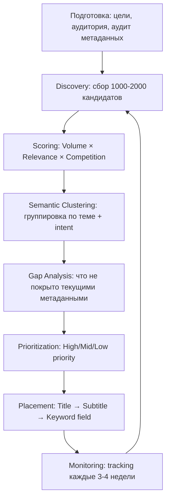

# ASO Keyword Research — Methods, Models, Semantics

## Summary

Keyword research для ASO — процесс нахождения поисковых запросов пользователей, их оценки по трём осям (volume × relevance × competition) и формирования портфеля ключей, которые максимизируют индексированный трафик при реально достижимых позициях. В 2025-2026 ключевой сдвиг: Apple Search переходит от exact match к семантическому ранжированию через NLP — кластеризация по intent стала обязательной частью методологии.

---

## Key Principles

- **70% открытий приложений происходят через поиск в сторе** [6]; keyword research — приоритет №1 в ASO
- **Три оси оценки**: Volume (Search Popularity) × Relevance × Competition. Один показатель без двух других бесполезен
- **Character budget**: keyword field iOS — 100 chars. Слова из title/subtitle не дублировать — они уже проиндексированы
- **Long-tail priority для новых приложений**: head-terms заняты топами с мощными поведенческими сигналами; long-tail — реально достижимые позиции
- **Семантика vs. exact match**: с 2025 Apple NLP матчит intent и тему, а не только строгое совпадение символов. Кластеры по теме важнее охвата отдельных слов [1]
- **Intent ≠ Semantic cluster**: одна тема (music) содержит несколько intent (streaming, offline playback, discovery). Оптимизировать нужно под оба уровня [1]
- **Reviews как источник**: пользователи в отзывах используют естественный язык поиска — лучший источник "непромпченной" семантики [1, 2]
- **Top-10 vs. 11-20**: топ-10 по ключевому слову даёт на 155% больше загрузок, чем позиции 11-20 [6]
- **Органические пользователи vs. платные**: retention органики в 3× выше чем платного трафика [6]

---

## Data / Models

### Scoring Framework (Composite)

```
Priority Score = Relevance × Volume × (1/Competition) × Conversion Potential
```

Каждый фактор нормируется к шкале 1-10, затем перемножается. AI-версия от Phiture [4] — адаптивная: веса пересчитываются динамически под контекст приложения.

| Фактор | Шкала | Источник данных | Вес (типовой) |
|---|---|---|---|
| Relevance | 0-100 (AppTweak Atlas AI) / 1-10 (ручная) | Семантический анализ + live SERP | Высокий |
| Volume (Search Popularity) | 1-100 (Apple) | **Search Term Popularity** для частых запросов, hints + `getRecommendedKeywords` для хвоста (см. ниже) | Высокий |
| Competition / Difficulty | 1-100 | Top-10 apps authority + installs | Средний |
| Chance Score | % | Сила своего приложения vs. конкурентов | Средний |
| Ranking Position | 1-250+ | Tracking tools | Для quick-wins |
| Conversion Potential | 1-10 | Исторические данные install rate | Средний |

### Search Popularity: три источника Apple и что каждый умеет (проверено 09.2026)

Раньше здесь стояло «searchPopularity в ASA API сломан, страну не учитывает». Это верно
не для всех поверхностей — у Apple их три, и свойства у них разные:

| Источник | Шкала | По стране | Своё приложение в нише | Покрытие |
|---|---|---|---|---|
| **Search Term Popularity** (Platform API, `platform_api.py --popularity`) | `searchPopularity1to100`, `…1to5`, `…InGenre`, `rankInGenre` | ✓ честно по стране | **не нужно** | только голова: топ-500 на жанр × страну, ≥ 500 поисков за период |
| `getRecommendedKeywords` (`keyword_popularity.py`, cookie/браузер) | 0–100 | см. ниже | нужно — adamId из своей ASA-организации | длинный хвост вокруг seed |
| `searchPopularity` в Impression Share отчёте | 1–5 | не перепроверено | нужна своя кампания | только ключи кампании |

**1. Search Term Popularity — первый источник для частых запросов.** Официальный эндпоинт
`POST /v1/insights/apps/search-term-popularity/query`. Проверено 09.2026: значения по
странам разные (`schrittzähler` — DE 64, AT 52; `kalorienzähler` — AT 69, в DE-топ не
попал), фильтр по списку ключей работает, регистр не важен.

```bash
python3 shared/asa/platform_api.py --popularity --countries DE,AT \
  --terms-file ./aso-collection/data/keywords/universe_{timestamp}.json \
  --out ./aso-collection/data/keywords/asa_popularity_official.csv
```

Ограничения:
- **Только голова.** В DE нижняя граница выборки ≈ 49 по `searchPopularity1to100`, в малых
  странах выше. Ключа нет в ответе → он ниже порога, а не «ноль».
- **15 жанров:** BUSINESS, EDUCATION, ENTERTAINMENT, FINANCE, FOOD_DRINK, GAMES,
  HEALTH_FITNESS, LIFESTYLE, NEW_PUBLICATION, PHOTO_VIDEO, PRODUCTIVITY_UTILITIES, SHOPPING,
  SOCIAL_NETWORKING, SPORTS, TRAVEL. Музыкальные, медицинские и т.п. запросы лежат в
  ENTERTAINMENT/LIFESTYLE. Один запрос может стоять в нескольких жанрах.
- Нет RU и BY. Месяцы хранятся 15 месяцев (обновление 5-го числа), недели — 65 недель.
- `searchPopularity1to5` — та же цифра, что в интерфейсе Apple Ads.
- Нужен Apple Ads API (`ASA_CLIENT_ID`, `ASA_KEY_ID` + PEM), cookie не нужен.

**2. `getRecommendedKeywords` — для длинного хвоста.** Отдаёт данные только для adamId
из своей ASA-организации и в тематике этого приложения; adamId конкурента — пустой массив
с HTTP 200. Параметр `storefronts` осмысленно меняет US-значения; глобальный ли score для
других стран — не проверено, поэтому для non-US используй его как вспомогательный сигнал:
```bash
python3 keyword_popularity.py --seeds "lebensmittel scanner,halal check" --storefronts DE,AT,CH
```

**3. `searchPopularity` в Impression Share отчёте** — шкала 1–5. Наблюдение 2026-04:
у почти всех ключей DE/AT/CH значение 2–3. Это может быть и потеря страны, и просто грубая
шкала — не перепроверено. Для объёма бери источник 1, IS-отчёт — для доли показов.

**Apple Search Hints / autocomplete (`keyword_suggest.py`)** — гео-точный порядок подсказок
без авторизации, но не объём:
```bash
python3 ~/.claude/skills/aso-collection/scripts/keyword_suggest.py \
  --term "lebensmit" --country de
```

**Сравнительная таблица инструментов:**

| Инструмент | Гео-точность | Абсолютный объём | Авторизация |
|---|---|---|---|
| Search Term Popularity (`platform_api.py`) | ✓ По стране | ✓ Относительный (1–100), только голова | Apple Ads API |
| Apple Search Hints (`keyword_suggest.py`) | ✓ Высокая (по сторфронту) | ✗ Нет (только порядок) | Не нужна |
| ASA Popularity (`keyword_popularity.py`) | ⚠️ Для non-US не проверено | ✓ Относительный (0–100) | Cookie ~24ч + своё приложение в нише |
| Реальные impressions в кампании | ✓ Точная (по кампейн-гео) | ✓ Абсолютный | ASA кампания |

**Практическое правило:** Если ключ не появляется в App Store autocomplete при вводе первых 3-4 символов в нужном сторфронте — его органический объём < 5-10 запросов в день. ASA может показывать по нему impressions (paid inventory), но органический трафик будет нулевым.

**Самый точный сигнал объёма для конкретного гео** — реальные impressions после запуска ключа в ASA кампании с правильным бидом. До кампании: голова — Search Term Popularity, хвост — hints + `getRecommendedKeywords`.

### Keyword Difficulty — Компонентная модель

Difficulty score (1-100) — взвешенный композит [из поисковых данных, 2025]:

| Компонент | Вес |
|---|---|
| Rating volume топ-приложений | 30% |
| Доминирующие игроки (концентрация) | 20% |
| Review velocity | 10% |
| Rating quality | 10% |
| Market age | 10% |
| Publisher diversity | 10% |
| Title relevance топ-10 | 10% |

Метки: Very Easy → Easy → Medium → Hard → Very Hard → Extreme

### Keyword Tiers (по Volume × Achievability)

| Tier | Search Popularity | Стратегия |
|---|---|---|
| Head | 70-100 | Таргетировать через ASA + органика если сильные сигналы |
| Mid | 40-69 | Основная зона органики для зрелых приложений |
| Long-tail | 10-39 | Приоритет для новых приложений; заполнить keyword field |
| Niche | 1-9 | Добивка оставшегося char budget |
| Zero / No hints | 0 | Пропустить (если не бренд) |

### Метаданные — Иерархия весов

| Поле | Символов | Вес для индексации | Приоритет ключей |
|---|---|---|---|
| Title | 30 | Максимальный | 1-2 primary |
| Subtitle | 30 | Высокий | Доп. high-value + value prop |
| Keyword Field | 100 | Средний | Long-tail, без дублей с title/subtitle |
| In-App Event title | 30 | Средний (с 2022) | Intent-specific термины |
| Custom Product Page | — | Средний (органика с июля 2025) | Keyword-specific страницы |

### Semantic Clustering — Трёхуровневая структура [AppTweak, 2025]

```
SEMANTIC THEME (уровень темы)
    └── e.g. "music"
         ├── KEYWORD CLUSTER (уровень кластера)
         │    ├── "music streaming app"
         │    ├── "listen to music"
         │    └── "music player"
         └── USER INTENT (уровень мотивации)
              ├── Comparison shopping → "best music app"
              └── Specific constraint → "offline music player"
```

**Почему важно**: Apple NLP (обнаружена смена алгоритма 05.06.2025) ранжирует по соответствию теме и intent-паттернам, а не точным словам. Кластер "music streaming" покрывает все варианты фразы без явного перечисления каждой [1].

### Discovery Sources — Ранжирование по качеству сигнала

| Источник | Качество сигнала | Описание |
|---|---|---|
| **Apple Search Term Popularity (Platform API)** | **Критический** | Официальная popularity по стране и жанру для частых запросов (топ-500 на жанр). Не требует своего приложения в нише. Нет ключа в ответе = ниже порога выборки |
| **Apple Search Hints (autocomplete)** | **Критический** | **Основной гео-сигнал для хвоста.** Hints = реальные запросы пользователей в конкретном сторфронте. Если ключ есть в hints → есть органический спрос. |
| Apple Search Ads suggestions | Высокий | Данные самого Apple из ASA UI; более надёжны чем API searchPopularity |
| Competitor metadata (title/subtitle/keyword field) | Высокий | Что индексируют лидеры |
| Competitor paid keywords (ASA) | Высокий | За что конкуренты платят = высокий коммерческий intent |
| ASA Impression Share (search terms) | Высокий | Показывает реальные запросы, по которым мы показываемся + наш share; кандидаты для EXACT таргетинга |
| Already-ranked keywords (own app) | Средний | Quick-win: поднять позицию без смены метаданных |
| User reviews mining | Средний | Непромпченный язык пользователей → natural search terms |
| ASA `getRecommendedKeywords` (cookie/браузер) | ⚠️ Ограничен | Отдаёт данные **только для adamId из твоей ASA-организации** и только в тематике этого приложения; adamId конкурента возвращает пустой массив с HTTP 200 (проверено 09.2026). Нет своего приложения в нише → объём хвоста получить неоткуда. Утверждение «не передаёт параметр страны» **не подтверждено**: запрос со `storefronts:['US']` возвращает осмысленные US-значения. Для частых запросов без своего приложения — Search Term Popularity. |
| Brainstorm (features/benefits/problems) | Низкий | Стартовая точка, всегда верифицировать через hints |

### Empirical Data — 7,500 App Store приложений (ConsultMyApp, Nov 2025) [5]

| Наблюдение | Данные |
|---|---|
| Stop-words в топ-приложениях | <3.2% filler words |
| Stop-words у приложений ranked 150-250 | В 4× чаще используют "the/and/your/with" |
| "App" в title топ-приложений | Только 1.1% |
| "Free" как standalone keyword | 0.6% всех приложений |
| Games: non-branded descriptors | <15% |
| Casino: keyword clustering (slots/jackpot/vegas/spin) | >50% заголовков/подзаголовков |
| Photo & Video: AI-термины | 22% |
| Health & Fitness: "track" | ~25% |
| Weather: "radar" | 28% |
| Travel: keyword diversity (ни один термин) | <9% |
| Games/Puzzle: dominant mechanic term | ~22% |

**Вывод**: Intent-глаголы (Learn, Track, Watch, Scan, Chat) работают лучше дескрипторов-существительных. Категория Travel — наибольшее разнообразие, Casino — наибольшая кластеризация.

---

## Research Process (Step-by-Step)



---

## Evolution / Trends

| Период | Изменение |
|---|---|
| До 2017 | Exact match dominates; keyword stuffing работает |
| 2017-2019 | Apple внедряет базовый NLP; semantic matching начинается |
| 2021 | Custom Product Pages → keyword-level A/B тестирование |
| 2022 | In-App Events title/subtitle индексируются |
| 2024 | Semantic matching mature; plurals/singulars автоматически |
| 05.06.2025 | Подтверждённое изменение алгоритма: broader intent matching [1] |
| Июль 2025 | CPP в органике → keyword-specific страницы без paid [2] |
| 2025-2026 | AI-assisted keyword research (Phiture, AppTweak Atlas AI); адаптивные scoring models [4] |
| 2025 (Google Play) | Guided Search — refinement of broad queries toward specific intents [1] |

---

## Open Questions & Gaps

- **Popularity длинного хвоста по стране**: официальный Search Term Popularity покрывает только голову (≈ 49+ по 1–100 в DE); для хвоста по non-US остаются hints и `getRecommendedKeywords`, чья гео-точность не проверена. Поле `searchPopularity` (1–5) в IS-отчёте в 2026-04 выглядело однородным для DE/AT/CH — причина не выяснена
- **Шкалы не откалиброваны между собой**: `searchPopularity1to100` официального эндпоинта и 0–100 из `getRecommendedKeywords` не сверены на общих ключах — не смешивать в одной сортировке
- **Search Popularity scale нелинейна**: Apple не публикует mapping score → volume. Score 70 vs 80 — разница неизвестна
- **Порядок слов в keyword field**: Industry consensus — не важен; Apple не подтвердил официально
- **Глубина semantic matching**: подтверждены plurals/singulars; multi-hop synonyms ("blood pressure" → "BP tracker") — threshold неизвестен
- **Cross-locale indexation**: объединяет ли Apple сигналы по ключам из разных локализаций одного приложения — unknown
- **Review text как источник индексации**: Apple намекает, но объём учитываемого контента не раскрыт
- **Decay rate**: как быстро падает позиция после удаления ключа из метаданных — нет надёжных данных

---

## Sources

1. AppTweak — "Adapt ASO to AI-driven app store search using semantic clusters" — apptweak.com/en/aso-blog/ai-reshaping-app-store-relevance (2025)
2. AppTweak — "App Store keyword research for ASO: The 2026 step-by-step guide" — apptweak.com/en/aso-blog/app-store-keyword-research-aso (2026)
3. MobileAction — "ASO keyword research in 2026: How to achieve better rankings" — mobileaction.co/blog/aso-keyword-research/ (2026)
4. Phiture — "Keyword Research with AI: Automating ASO with No-Code Tools" — phiture.com/asostack/automating-aso-keyword-research-with-ai/ (2025)
5. ConsultMyApp — "App Store Keywords: Full Data & Analysis of 7,500 Apps" — consultmyapp.com/blog (Nov 2025)
6. AppSamurai — "Strategic Keyword Research for Mastering ASO" — appsamurai.com/blog (Mar 2025)

---

## Reuse Hooks

- **Старт исследования**: Discovery → 1000-2000 кандидатов → scoring → кластеризация по теме → gap vs. текущие метаданные
- **Semantic clustering**: группировать по теме (что), потом по intent (почему) — не по форме ключа
- **Character budget audit**: `len(",".join(keywords)) ≤ 100`; удалить слова из title/subtitle; убрать stop-words
- **Achievability check**: difficulty score + смотреть кол-во reviews у топ-3 конкурентов. Новое приложение — таргетить там, где топ-3 имеет <10k reviews
- **Reviews mining**: искать повторяющиеся глаголы и проблемы → они = реальный поисковый язык пользователей
- **Intent-глаголы**: Track, Learn, Scan, Watch, Chat — работают лучше дескрипторов в metadata
- **Re-evaluation cadence**: каждые 3-4 недели или после изменений метаданных конкурентов

---

_Update log: 2026-03-06 — initial version, sources: AppTweak (2025-2026), MobileAction (2026), Phiture (2025), ConsultMyApp (Nov 2025), AppSamurai (Mar 2025)_
_Update log: 2026-09-24 — раздел Search Popularity переписан: три источника Apple с проверенными свойствами; официальный Search Term Popularity (Platform API) учитывает страну — прежнее «searchPopularity сломан» к нему не относится. Источник: Apple Ads Platform API docs + живые запросы 09.2026_
