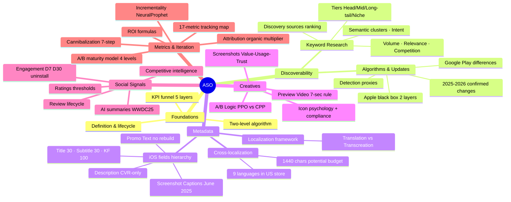

# ASO Theory Base — Master Reference

> Сводный документ по всей теоретической базе ASO.
> Ветки: foundations · keyword_research · metadata · creatives · social_signals · algorithms · metrics_iteration
> Последнее обновление: 2026-03-06

---

## MECE Knowledge Tree



---

## Cross-Reference Map

Как ветки связаны между собой — что нужно читать вместе.

| Если работаешь с… | Читай также… | Связь |
|---|---|---|
| **keyword_research** | metadata | Scoring → размещение в fields hierarchy |
| **keyword_research** | algorithms | Semantic clustering ↔ NLP changes June 2025 |
| **keyword_research** | social_signals | Reviews mining → natural language для keyword discovery |
| **metadata** | keyword_research | Character budget audit требует scoring |
| **metadata** | creatives | Screenshot captions (с июня 2025) — metadata + creative одновременно |
| **metadata** | algorithms | Cross-localization → 9 indexed langs в US → зависит от алгоритма индексации |
| **creatives** | metrics_iteration | PPO A/B test → статистика из metrics_iteration (95% confidence, 7 days min) |
| **creatives** | foundations | CVR → ranking signal: creatives влияют на позицию через install rate |
| **social_signals** | algorithms | Uninstall rate штраф + Google Gemini behavioral display → алгоритмические последствия |
| **social_signals** | metrics_iteration | Review sentiment delta → предсказывает CVR падение (метрика) |
| **algorithms** | metrics_iteration | Algorithm change detection → anomaly в keyword volatility метрике |
| **algorithms** | keyword_research | Intent-matching update 05.06.2025 → пересмотр semantic clustering |
| **metrics_iteration** | social_signals | D7/D30 retention → ranking signal (social_signals подтверждает) |
| **metrics_iteration** | creatives | A/B budget allocation 60/20/20 → из AppAgent data |

### Ключевые зависимости (цепочки)

```
Keyword Research
    → Metadata (размещение)
        → Creatives / Screenshot Captions (с 2025 — одновременно)
            → CVR (Foundations funnel)
                → Ranking Position (Algorithms)
                    → Metrics tracking (Metrics & Iteration)
                        → Next iteration
```

```
Social Signals (Reviews → Rating)
    → Ranking (Algorithms: rating threshold 3.5)
    → CVR (Creatives: trust layer в screenshots)
    → Metrics (sentiment delta → predict CVR drop)
```

---

## 2026 Trends Summary (Live Data)

Собрано из актуальных источников: AppTweak (2026), ASOMobile (Jan 2026), AnalyticaHouse (2026), Google Play System Update (Feb 2026).

### Platform-level changes

| Изменение | Платформа | Дата | Статус |
|---|---|---|---|
| Ads beyond top position в поиске | Apple | Март 2026 (phased: UK → JP → global) | Активный rollout |
| CPP doubled: 35 → 70 + keyword assignment | Apple | Ноябрь 2025 | Активно |
| CPP в органических результатах поиска | Apple | Июль 2025 | Активно |
| Screenshot captions индексируются | Apple | Июнь 2025 | Активно |
| AI review summaries на product page | Apple | WWDC25 | Активно |
| AI-generated app tags (iOS 26) | Apple | Beta 2025 | Beta |
| Dedicated Games app в iOS 26 | Apple | 2025-2026 | В разработке |
| "Ask Play" (Gemini AI assistant) | Google Play | Январь 2026 (v49.3) | Активно |
| Battery vital: wake locks < 5% | Google Play | С 01.03.2026 | Активно |
| LevelUp program для game publishers | Google Play | 2025-2026 | Активно |
| Guided Search — intent refinement | Google Play | 2025 | Активно |

### Стратегические сдвиги 2026

**1. От keywords к intent**
2026 зафиксирован как год завершения перехода от keyword precision к semantic coherence. Apple NLP June 2025 update показал "highest anomaly scores ever detected" — результаты поиска теперь показывают diversity intent-типов, а не кластеры вокруг одного keyword. → _Подробнее: aso_keyword_research.md, aso_algorithms.md_

**2. AI-assisted optimization становится стандартом**
Phiture, AppTweak Atlas AI, MobileAction — автоматизация keyword scoring и clustering. 1000-2000 кандидатов → <200 через AI-фильтрацию. → _Подробнее: aso_keyword_research.md_

**3. Fragmented discovery**
ChatGPT и AI-ассистенты начинают генерировать трафик на app store страницы. Google Play "Ask Play" — первый официальный AI-powered discovery в сторе. Оптимизация description под AI-интерпретацию (clarity > keyword density). → _Подробнее: aso_algorithms.md_

**4. Organic growth = must-have (не nice-to-have)**
Privacy изменения + рост CPI → organic retention в 3× выше paid. Organic multiplier снижается (~-20% с 2016), но органика — единственный канал с устойчивым LTV. Локализованные listings +49% installs в multilingual regions. → _Подробнее: aso_metrics_iteration.md_

**5. CVR > traffic**
Apps с 4.5+ rated в 2.1× чаще попадают в топ-50. +3-5% CVR = материальный рост органики без допрасходов. → _Подробнее: aso_creatives.md, aso_social_signals.md_

**6. Technical compliance как ranking фактор**
Battery vital (01.03.2026), crash/ANR < 8% — несоответствие = exclusion из featured surfaces. Visual consistency (Liquid Glass) заявлена Apple как ranking-relevant. → _Подробнее: aso_algorithms.md, aso_creatives.md_

---

## Knowledge Gaps Matrix

Систематизация всех открытых вопросов из всех веток. Приоритет = impact × likelihood of resolution.

| Gap | Ветка | Приоритет | Почему неизвестно | Как мониторить |
|---|---|---|---|---|
| **Точные веса ranking факторов** | algorithms, foundations | Высокий | Apple/Google не раскрывают. DMA раскрытие = tier, не веса | Корреляционные исследования ASO tools ежеквартально |
| **Персонализация vs. universal rank** | algorithms, foundations | Высокий | Нет публичных данных о степени персонализации | A/B тесты с разными user profiles |
| **Search Popularity нелинейность** | keyword_research | Высокий | Apple не публикует score → volume mapping | Reverse-engineer через install data vs. position |
| **Semantic matching threshold** | keyword_research, algorithms | Высокий | Подтверждены plurals/singulars; multi-hop — unknown | Тестирование synonyms без explicit indexation |
| **AI-теги iOS 26 ranking impact** | algorithms, metadata | Высокий | В beta; production не вышли | Мониторинг App Store Connect тегов после launch |
| **Screenshot captions ranking delta** | metadata, creatives | Средний | Сигнал подтверждён (июнь 2025), magnitude неизвестен | Before/after incrementality по приложениям обновившим captions |
| **Organic multiplier by category** | metrics_iteration | Средний | AppsFlyer публикует агрегаты, не разбивку | Category-specific shutoff experiments |
| **Review text → keyword indexation** | social_signals, keyword_research | Средний | Apple документация размытая | Тестирование: ключ только в reviews → rank появляется? |
| **CPP organic long-term impact** | algorithms, metadata | Средний | Появились июль 2025 — мало данных | 6-месячный трекинг organic traffic distribution |
| **What's New индексация глубина** | metadata | Средний | Некоторые источники подтверждают, Apple официально нет | Incrementality тест: обновить What's New с уникальными keywords |
| **Cross-locale signal merging** | metadata, keyword_research | Средний | Неизвестно, объединяет ли Apple сигналы по локалям | Тест: одно ключевое слово только в es-MX → rank в US? |
| **Keyword field порядок** | metadata, keyword_research | Низкий | Industry consensus "не важен"; официально не подтверждено | A/B тест: высокоприоритетный ключ first vs last |
| **DMA tier structure детали** | algorithms | Низкий | Apple раскрыл существование tier, не механику | Следить за EC решениями по DMA |
| **Halo effect by keyword type** | metrics_iteration | Низкий | Брендовые vs. generic ключи — разный uplift, не изучено | Campaign-level shutoff experiments |
| **"Ask Play" оптимизация** | algorithms | Низкий | Новый feature (Jan 2026), нет данных | Мониторинг Google Play Console traffic sources |

---

## Master Sources Index

Полный список источников по всем веткам, дедуплицированный.

**AppTweak (2025-2026)**
- What is ASO and why is it important — 2026
- App Store ranking factors — 2026
- Keyword research step-by-step guide — 2026
- AI-driven search: semantic clusters — 2025
- Product page optimization A/B testing guide — 2025
- Incrementality analysis — 2025
- ASO trends to watch in 2026 — 2026
- ASO news & store updates 2026 — 2026

**MobileAction (2026)**
- ASO KPIs: Measuring what matters — 2026
- App Store ranking factors — 2026
- ASO keyword research — 2026
- How to respond to app store reviews — 2026

**SplitMetrics (2025)**
- App Store ranking factors (2025 News) — 2025
- ASO competitive research guide — 2025
- A/B testing beginner's guide — 2025

**Apple Developer (Official)**
- App Store Connect: Overview of PPO — 2025
- App Store Review Guidelines — 2025
- Complying with DMA — 2025

**AppFollow (2026)**
- Advanced ASO strategies webinar recap — 2026

**Phiture (2025)**
- A/B testing framework — 2025
- Automating keyword research with AI — 2025

**AppsFlyer (2025)**
- Organic uplift multiplier — 2025

**ConsultMyApp (Nov 2025)**
- App Store Keywords: Full Data & Analysis of 7,500 Apps — 2025

**arXiv Academic (2025)**
- Complementarity Between Paid and Organic Installs — 2025

**ARPU Brothers (2025)**
- Google Play algorithm changes June 2025 — 2025

**1440.io (2026)**
- State of Customer Reviews — 2026

**Gummicube / Adalo / ASO.dev / ASOMobile / AppAgent / AppSamurai / The App Launchpad**
- Метаданные, creatives, cross-localization — 2025-2026

---

## Quick-Start Checklist (per project)

Минимальный набор действий при старте нового ASO-проекта, опирающийся на все ветки.

```
[ ] foundations    → определить KPI baseline по 5 категориям
[ ] keyword_res    → собрать 1000+ кандидатов → scoring → clusters → gap
[ ] metadata       → аудит дублирования полей → character budget < 160 chars
[ ] metadata       → cross-localization: заполнить es-MX отдельными ключами
[ ] creatives      → audit: 1-2 скриншота communicates value без скролла?
[ ] creatives      → captions содержат target keywords (с июня 2025)
[ ] social_signals → проверить avg rating: < 3.7 → review prompting приоритет
[ ] social_signals → competitive gap: title+subtitle топ-3 конкурентов
[ ] algorithms     → проверить anomaly detector перед изменениями (aso.dev)
[ ] algorithms     → Android: Vitals в норме (crash < 8%, battery < 5%)
[ ] metrics_iter   → установить baseline CVR, SOV, D7 retention
[ ] metrics_iter   → cannibalization check если есть ASA кампании
```

---

_Update log: 2026-03-06 — initial compilation from 7 branches. Sources span AppTweak, MobileAction, SplitMetrics, Apple Developer, Phiture, AppsFlyer, arXiv (2025-2026)._
